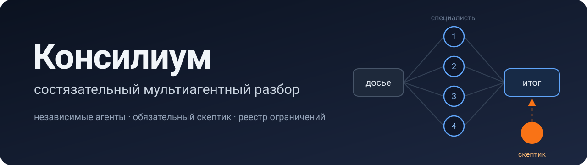

<h1 align="center">claude-skills</h1>

<p align="center">Скиллы для Claude — для задач, где одного взгляда недостаточно.</p>

<p align="center">
  <a href="LICENSE"></a>
  <a href="https://github.com/Andrey-Batrimenko/claude-skills/releases"></a>
  
</p>

> **EN.** A shelf of Claude skills for work where a single line of reasoning is not enough. The first one is **consilium** — an adversarial multi-agent review: specialist agents work in parallel on a shared numbered dossier, a mandatory skeptic attacks the orchestrator's conclusions, disagreements are resolved in the open, and a restrictions registry makes every next round cheaper. The skills are written in Russian and tuned for Russian-language work. They follow the open Agent Skills standard and also run in ChatGPT, Codex, Cursor, Gemini CLI, GitHub Copilot and other compatible agents.

## Скиллы

<a href="plugins/consilium"></a>

**[Консилиум](plugins/consilium)** — состязательный мультиагентный разбор готового материала. Несколько независимых агентов-специалистов работают параллельно, обязательный скептик атакует выводы, оркестратор проверяет ключевые факты сам, публично разрешает споры и признаёт собственные ошибки.

| Область | Что приносите |
|---|---|
| **Медицина** | анализы из разных лабораторий и расходящиеся заключения врачей |
| **Юридический кейс** | договор с приложениями перед подписанием или в начале спора |
| **Код** | архитектурное решение или крупное изменение перед релизом |
| **Научная статья** | рукопись перед подачей в журнал |
| **Статья, отчёт, записка** | черновик перед публикацией |
| **Бизнес и инвестиции** | бизнес-план, финансовая модель или решение о сделке |
| **Разбор инцидента** | логи, хронология и объяснения участников после сбоя |
| **Выбор поставщика или технологии** | коммерческие предложения и технические сравнения |
| **Соответствие требованиям** | документация перед проверкой, аудитом или тендером |

> [!NOTE]
> Это примеры, а не список ограничений. Консилиум сам проектирует роли под задачу, поэтому подходит для любого материала, где ошибка дорого стоит, источники расходятся, а работу можно разделить на независимые зоны.

**[Зачем он нужен, почему в нём несколько агентов и как он устроен →](plugins/consilium)**

## Установка

### Скачать

| Файл | Для чего |
|---|---|
| [**consilium.skill**](https://github.com/Andrey-Batrimenko/claude-skills/releases/latest/download/consilium.skill) | claude.ai и Claude Desktop |
| [**consilium.zip**](https://github.com/Andrey-Batrimenko/claude-skills/releases/latest/download/consilium.zip) | ChatGPT, Codex, Cursor, Gemini CLI, GitHub Copilot и другие агенты |

Ссылки всегда ведут на последнюю версию. Внутри оба файла одинаковые — архив с папкой `consilium`.

> [!TIP]
> Codex, Cursor, Gemini CLI и GitHub Copilot в VS Code читают общую папку скиллов `~/.agents/skills/`. Распакуйте туда `consilium.zip`, чтобы получилось `~/.agents/skills/consilium/SKILL.md`, и перезапустите агента — этого достаточно для всех четырёх.

### Инструкции по инструментам

<details>
<summary><b>Claude Code</b></summary>

```
/plugin marketplace add Andrey-Batrimenko/claude-skills
/plugin install consilium@andrey-batrimenko
```

Обновления сторонних маркетплейсов сами не приходят: запустите `/plugin marketplace update andrey-batrimenko` или включите автообновление в `/plugin` → `andrey-batrimenko` → Enable auto-update. Вызов вручную — `/consilium:consilium`.

Без маркетплейса: скопируйте папку `plugins/consilium/skills/consilium` в `~/.claude/skills/`.

</details>

<details>
<summary><b>claude.ai и Claude Desktop</b></summary>

Скачайте [consilium.skill](https://github.com/Andrey-Batrimenko/claude-skills/releases/latest/download/consilium.skill) и загрузите его в настройках Claude, в разделе скиллов.

</details>

<details>
<summary><b>ChatGPT</b></summary>

Скачайте [consilium.zip](https://github.com/Andrey-Batrimenko/claude-skills/releases/latest/download/consilium.zip), затем в ChatGPT: **Skills → Create → Upload from your computer** и выберите архив.

**Кому доступно.** По справке OpenAI загрузка скиллов есть на рабочих тарифах ChatGPT — Business, Enterprise, Edu — и только если администратор рабочего пространства их включил. Если раздела Skills нет, подключите скилл через Codex.

</details>

<details>
<summary><b>Codex</b></summary>

**Способ 1 — плагином, с обновлениями.** Codex читает маркетплейсы в формате Claude, поэтому этот репозиторий подключается как есть:

```
codex plugin marketplace add Andrey-Batrimenko/claude-skills
codex plugin add consilium@andrey-batrimenko
```

После установки начните новый чат, чтобы Codex подхватил скилл. Новые версии приходят при обновлении маркетплейса или перезапуске Codex.

**Способ 2 — встроенным установщиком.** Напишите в чате Codex:

```
$skill-installer install https://github.com/Andrey-Batrimenko/claude-skills/tree/main/plugins/consilium/skills/consilium
```

Установщик скачает папку скилла в `~/.codex/skills/consilium`; затем перезапустите Codex. Сам скилл так не обновится: чтобы поставить новую версию, удалите эту папку и выполните команду ещё раз.

**Способ 3 — из архива.** Распакуйте [consilium.zip](https://github.com/Andrey-Batrimenko/claude-skills/releases/latest/download/consilium.zip) в `~/.agents/skills/` — для всех проектов — или в `.agents/skills/` внутри проекта и перезапустите Codex.

Вызвать вручную: наберите `$` и выберите консилиум из списка или откройте `/skills`.

</details>

<details>
<summary><b>Cursor</b></summary>

Распакуйте [consilium.zip](https://github.com/Andrey-Batrimenko/claude-skills/releases/latest/download/consilium.zip) в `~/.cursor/skills/` или `~/.agents/skills/` — либо в `.cursor/skills/` внутри проекта — и перезапустите Cursor. Вызов вручную — `/consilium` в чате агента.

**Примечание.** Файл `.skill` или `.zip` в Cursor напрямую не загружается — только распакованной папкой. Если скилл уже скопирован вручную в `~/.claude/skills/consilium`, Cursor найдёт его и там.

</details>

<details>
<summary><b>Gemini CLI</b></summary>

Распакуйте [consilium.zip](https://github.com/Andrey-Batrimenko/claude-skills/releases/latest/download/consilium.zip) в `~/.gemini/skills/` или `~/.agents/skills/`, затем в сессии выполните `/skills reload`. Либо установите из распакованной папки:

```
gemini skills install ~/Downloads/consilium --consent
```

</details>

<details>
<summary><b>GitHub Copilot в VS Code</b></summary>

Распакуйте [consilium.zip](https://github.com/Andrey-Batrimenko/claude-skills/releases/latest/download/consilium.zip) в `~/.copilot/skills/` или `~/.agents/skills/` — либо в `.github/skills/` внутри проекта.

</details>

<details>
<summary><b>Другие агенты</b></summary>

Консилиум написан по открытому стандарту [Agent Skills](https://agentskills.io). Инструменты, которые его поддерживают, подключают скилл одинаково: распакуйте [consilium.zip](https://github.com/Andrey-Batrimenko/claude-skills/releases/latest/download/consilium.zip) в их папку скиллов.

</details>

> [!IMPORTANT]
> Формат скилла переносится между агентами, а поведение — не везде одинаково. Консилиум опирается на параллельных субагентов с изолированным контекстом. Где их нет, агент пройдёт роли по очереди в одном контексте: разбор получится, но главный механизм — независимость агентов — ослабнет.

## Разработка

Как выпустить новую версию скилла — в [RELEASING.md](RELEASING.md).

## Лицензия

[MIT](LICENSE) © Andrey Batrimenko
