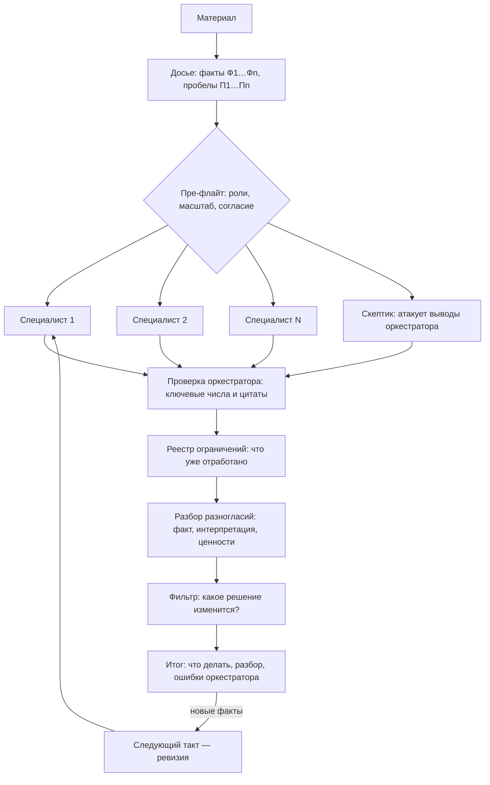

  

  
  
  

> **EN.** Adversarial multi-agent review for material where a mistake is expensive and sources disagree. Four to seven specialist agents with non-overlapping zones read one shared, numbered dossier and work in parallel without seeing each other; a mandatory skeptic attacks the orchestrator's reasoning; the orchestrator verifies key facts itself, resolves disagreements in the open and lists its own errors found by the agents. Between rounds a restrictions registry records what has already been checked, so the next round does not redo it — and the skeptic is obliged to attack that registry too.

**Консилиум** — скилл для Claude, который превращает «разберись с этими документами» в состязательную экспертизу. Материал разбирают несколько независимых агентов-специалистов, обязательный скептик атакует выводы, а оркестратор сам проверяет ключевые факты, публично разрешает споры и признаёт собственные ошибки.

> [!TIP]
> Ценность создаёт не число агентов, а **встроенный конфликт**. Консилиум, где все согласились и оркестратор ничего у себя не исправил, — провалившийся консилиум, даже если текст получился красивым.

## Зачем он нужен

Разбирая сложный материал в одном ответе, модель строит одну версию и дальше её подтверждает. Ошибка в прочитанной цифре молча расходится по всем выводам, спорные места сглаживаются в уверенный текст, открытые источники трудно отличить от воспроизведённых по памяти, а список «что ещё проверить» растёт без конца. Для простых вопросов это неважно. Для материала, где ошибка стоит денег, здоровья или репутации, — критично.

Консилиум заменяет один ответ процессом, в котором у каждого вывода есть оппонент.

| | Один запрос | Консилиум |
|---|---|---|
| **Кто разбирает** | одна линия рассуждения | 4–7 специалистов с непересекающимися зонами |
| **Кто спорит** | никто | обязательный скептик |
| **Ошибка в исходных фактах** | молча расходится по выводам | ловится сверкой с первоисточником; видно, какие выводы на ней стояли |
| **Разногласия** | сглажены | показаны и разобраны по типам |
| **Источники** | открытые не отличить от воспроизведённых по памяти | только открытые, пробелы помечены |
| **План действий** | разрастается | остаётся то, что меняет решение |
| **На выходе** | гладкий ответ | ответ, ошибки оркестратора и честные пробелы |

## Почему несколько агентов

**Независимость против якоря.** Прочитав первую гипотезу, модель склонна её подтверждать. Агенты, которые не видят работы друг друга, не заражаются чужой версией. Если они всё же сходятся — разными путями, из разных зон, — это доказательство, а не эхо.

**Чистый контекст для каждой зоны.** В одном запросе медицинские, юридические и методологические детали конкурируют за внимание. У специалиста в контексте только досье и его зона: он копает глубже и реже теряет детали.

**Настоящий оппонент.** Модели трудно всерьёз спорить с собственным текстом, и самокритика в том же ответе обычно косметическая. Отдельный агент, чья единственная задача — ломать, находит то, чего автор версии не видит.

**Проверка проверяющего.** Оркестратор тоже ошибается — в чтении фактов, в подсчётах, в ссылках. Агенты сверяются с первоисточником и находят его ошибки, а итог обязан их перечислить.

**Параллельность.** Зоны разбираются одновременно: такт занимает десятки минут, а не часы последовательной работы.

**Видимые разногласия.** Когда специалисты расходятся, это карта мест, где знание неполно. Один ответ такие места стирает.

> [!IMPORTANT]
> У мультиагентности есть цена и предел. Такт стоит в разы дороже обычного запроса. А если все агенты работают на одной модели, их слепые пятна могут совпадать, и схождение окажется слабее, чем выглядит. Поэтому первая идея развития — [разные модели для разных ролей](#идеи-по-развитию).

## Когда применять

Нужны все четыре условия сразу:

1. Материал разнородный или объёмный — несколько документов, форматов, дат.
2. Внешние стандарты, нормы или литература расходятся между собой.
3. Ошибка стоит денег, здоровья, юридических последствий или репутации.
4. Задача распадается на непересекающиеся предметные зоны.

Не применять, если есть один правильный ответ, хватает одного поиска или нужна скорость.

## Примеры

Несколько типичных случаев — для ориентира.

| Ситуация | Роли | Что ищет скептик | Что на выходе |
|---|---|---|---|
| **Медицина.** Анализы за несколько лет из разных лабораторий, заключения врачей расходятся | по системам органов, прогноз | несопоставимые измерения; разовый выброс, выданный за динамику | вопросы к лечащему врачу и обследования, у каждого указано, какое решение оно изменит |
| **Юридический кейс.** Договор с приложениями и перепиской — перед подписанием или в начале спора | обязательства и сроки, ответственность, регуляторика, налоги | как документы прочтёт противная сторона | риски по приоритету и формулировки, которые стоит изменить |
| **Код.** Архитектурное решение или крупное изменение перед релизом | производительность, надёжность, безопасность, стоимость эксплуатации | как именно это сломается в продакшене | дефекты по серьёзности и их влияние на решение выпускать |
| **Научная статья.** Рукопись перед подачей в журнал | структура и аргументация, теоретическая рамка, методология, проверка источников, язык | есть ли новизна и не опубликован ли тот же тезис раньше | замечания по разделам и список литературы с пометками, что подтверждено |
| **Статья, отчёт, записка.** Готовый черновик перед публикацией | факты и цифры, логика выводов, аудитория, стиль | к чему прицепится придирчивый читатель | уязвимые места и что с ними сделать |
| **Бизнес и инвестиции.** Бизнес-план, финансовая модель или решение о сделке | рынок, юнит-экономика, команда, конкуренты | почему это не сработает и какое допущение держит всю модель | допущения, от которых зависит решение, и что проверить до вложений |
| **Разбор инцидента.** Логи, хронология и объяснения участников после сбоя | хронология, техническая причина, процесс, коммуникация | где корреляция выдана за причину, а «после» — за «вследствие» | подтверждённая цепочка причин и что закрыть, чтобы не повторилось |
| **Выбор поставщика или технологии.** Коммерческие предложения, сравнения, отзывы | цена и условия, сроки, качество, риски внедрения | что в предложении выглядит выгодно, но означает другое | сравнение только по критериям, которые меняют выбор |
| **Соответствие требованиям.** Документация перед проверкой, аудитом или тендером | по регуляторам и разделам требований | где формально соблюдено, а по существу нет | несоответствия по серьёзности и что исправить до проверки |

> [!TIP]
> **Области выше — примеры, а не ограничение.** Консилиум не привязан к предметной области: роли не берутся из готового списка, оркестратор проектирует их под конкретную задачу. Он делит материал на непересекающиеся зоны и назначает скептика, который атакует именно тот тип рассуждений, где в этой задаче чаще всего ошибаются. От задачи к задаче меняются только зоны. Механизмы — общее досье, независимость агентов, скептик, проверка оркестратора, реестр ограничений — остаются теми же.
>
> Подходит любая задача, где выполняются [четыре условия](#когда-применять): материал объёмный или разнородный, источники расходятся, ошибка дорого стоит, а работу можно разделить на независимые зоны.

> [!NOTE]
> Консилиум не ставит диагнозов и не заменяет врача или юриста: он готовит вопросы и показывает, где знание неполно. Текст с нуля он тоже не пишет — он разбирает готовое.

## Как устроено

## На чём это держится

### 1. Одно досье на всех — с номерами фактов

До запуска агентов оркестратор собирает все факты в один файл и нумерует их: Ф1, Ф2… Агенты ссылаются на номера. Когда в досье находится ошибка — а это случается регулярно, — видно, какие выводы на ней стояли. Раздел «чего в материале нет» не даёт агентам достраивать недостающее из воображения. Каждый агент получает прямую инструкцию: досье может быть неверным, сверяйся с первоисточником, найденная ошибка ценнее согласия.

### 2. Независимость — чтобы схождение было доказательством

Внутри такта агенты не видят работы друг друга. Если два агента из разных зон пришли к одному выводу разными путями, это весомее уверенного утверждения одного. Стоит показать им чужие тексты — и схождение превращается в эхо.

### 3. Обязательный скептик

Его задача — ломать, а не дополнять. Он получает список выводов оркестратора отдельным блоком и бьёт по ним адресно: возражение → насколько оно сильное → как проверить. И обязан отдельно сказать, где версия всё-таки права.

### 4. Честность как механика, а не добродетель

- Каждое ключевое утверждение помечено: **[Ф]** проверено в первоисточнике, **[Д]** взято из досье без сверки, **[В]** вывод, **[Г]** гипотеза.
- В выводе каждого агента обязателен раздел «где я могу ошибаться».
- Протокол источников: приводить только реально открытые; ненайденный источник лучше выдуманного; неудачный поиск не доказывает, что работы не существует.

### 5. Оркестратор проверяет сам и публикует свои ошибки

Ключевые числа и цитаты оркестратор перепроверяет независимо от агентов. В итоговом документе обязателен раздел «мои ошибки, найденные агентами».

### 6. Разногласия классифицируются, а не сглаживаются

| Тип спора | Что с ним делать |
|---|---|
| Фактический | назвать проверку, которая его закроет |
| Интерпретационный | назвать, каких данных не хватает |
| Ценностный | решает пользователь; агенты раскладывают варианты |

По каждому возражению скептика выносится явный вердикт: принято или отклонено — и почему.

### 7. Фильтр разрастания

У каждого пункта итогового плана заполнена графа «какое решение изменится в зависимости от результата». Пункты вида «уточнить картину» удаляются.

### 8. Такты и реестр ограничений

Разбор идёт тактами. После каждого оркестратор пополняет реестр: что уже проверено, какие маршруты к источникам не работают, какие вопросы закрыты, какие действия отклонены. Следующий такт не делает эту работу заново.

Реестр легко превращается в кляп, когда ранняя ошибка оркестратора застывает как закон. Поэтому он ограничивает **процесс, а не мышление**: запись «вывод X считать верным» запрещена, у каждой записи есть основание и условие снятия, а скептик каждый такт обязан пытаться сломать хотя бы одно ограничение. Остановка объективна: такт, который не добавил ни одного проверенного ограничения и не изменил ни одного вывода, — последний.

## Как понять, что консилиум сработал

> [!WARNING]
> Плохой признак — все согласны, разногласий нет, оркестратор ничего у себя не исправил. Скорее всего, зоны ролей пересекались или скептик был декоративным.

В хорошем итоге есть:

- [x] список ошибок оркестратора с именами нашедших;
- [x] явно неразрешённые разногласия с указанием, какого факта не хватает;
- [x] выводы, к которым независимо пришли несколько агентов;
- [x] пункты, удалённые из плана как не меняющие решений;
- [x] источники с пометкой «получить не удалось».

Последний пункт недооценён: документ, где все ссылки якобы открыты и все числа известны, подозрительнее документа с честными пробелами.

## Цена и масштаб

| Масштаб | Состав | Когда |
|---|---|---|
| Быстрый разбор | 2–3 роли, скептик обязателен | цена ошибки средняя, материал однородный |
| Полный консилиум | 5–7 ролей и скептик | выполняются все четыре условия |
| Следующий такт | те же роли в режиме ревизии | появились новые факты или снято ограничение |

Полный такт с поиском по источникам — это десятки минут и большой расход токенов. Перед запуском скилл показывает состав ролей и масштаб и спрашивает согласия.

## Запуск

Скилл срабатывает сам на запросах вроде «собери консилиум», «разбери с разных сторон», «проверь мои выводы», «что я упускаю», «нужно второе мнение» — и когда вы приносите пачку документов с высокой ценой ошибки. Явный вызов: `/consilium:consilium` в Claude Code, `$consilium` в Codex, `/consilium` в Cursor.

Консилиум написан по открытому стандарту [Agent Skills](https://agentskills.io) и работает не только в Claude: в ChatGPT, Codex, Cursor, Gemini CLI, GitHub Copilot и других совместимых агентах. Полноценно — там, где есть субагенты: в Claude Code, Claude Desktop, Cowork и агентах с поддержкой субагентов. Без них роли придётся проходить последовательно, и главный механизм — независимость агентов — ослабнет.

Скачать и установить в любой из этих инструментов — в [README репозитория](../../README.md#установка).

## Уроки между разборами

Скилл ведёт у пользователя локальный файл `~/.claude/consilium/method.md` с переносимыми уроками прошлых разборов. Он читается перед каждым разбором и никуда не отправляется. Туда идёт только методическое, а предметное остаётся в реестре конкретного разбора.

> [!CAUTION]
> Предметные детали — числа, названия, фрагменты документов — просачиваются в уроки незаметно. Перед тем как делиться этим файлом, прочитайте его целиком.

## Идеи по развитию

Это направления, а не обещания.

### Разные модели для разных ролей

Сейчас все агенты по умолчанию работают на одной модели и делят её слепые пятна. Если скептик и часть специалистов работают на других моделях, схождение выводов становится весомее: к одному ответу пришли системы, которые ошибаются по-разному. Заодно падает цена такта.

| Роль | Модель | Почему |
|---|---|---|
| Оркестратор | самая сильная, например Opus | сводит противоречия и выносит вердикты |
| Скептик | сильная, но не та же, что у оркестратора | чтобы не разделять его слепые пятна |
| Специалисты с глубокими зонами | Sonnet | баланс глубины и цены |
| Сверка источников, подсчёты, поиск по тексту | Haiku | рутина, где важны скорость и объём |

В Claude Code модель задаётся для каждого субагента отдельно, так что это правка инструкций запуска, а не новая инфраструктура.

### Скептик на модели другого разработчика

Максимальная независимость ошибок. Подключается через MCP или API, но сложнее в настройке и требует отдельного ключа.

### Метрики калибровки

Считать между разборами, сколько ошибок оркестратора нашли агенты, сколько возражений скептика подтвердилось и сколько ограничений реестра снято. Это покажет, где механизм работает вхолостую.

### Сведение правок в документ

Когда несколько агентов правят один текст, находить настоящие конфликты по пересечению фрагментов, а не по номеру абзаца, и собирать итог в режим рецензирования Word с комментариями на полях.

### Эталонные разборы

Набор тестовых случаев, на которых новая версия скилла сравнивается с прежней до выхода релиза.

## Файлы

| Файл | Что внутри |
|---|---|
| `skills/consilium/SKILL.md` | порядок работы по шагам |
| `references/prompts.md` | готовые промпты агентам, скептику, для ревизии; шаблон досье |
| `references/roles.md` | как проектировать роли, примеры по предметным областям |
| `references/sourcing.md` | протокол источников и рабочие маршруты к литературе |
| `references/restrictions.md` | реестр ограничений, такты, уроки между разборами |
| `references/failure-modes.md` | что ломалось на реальных разборах и как это ловится |

Изменения по версиям — в [CHANGELOG](CHANGELOG.md).

## Лицензия

[MIT](../../LICENSE) © Andrey Batrimenko
